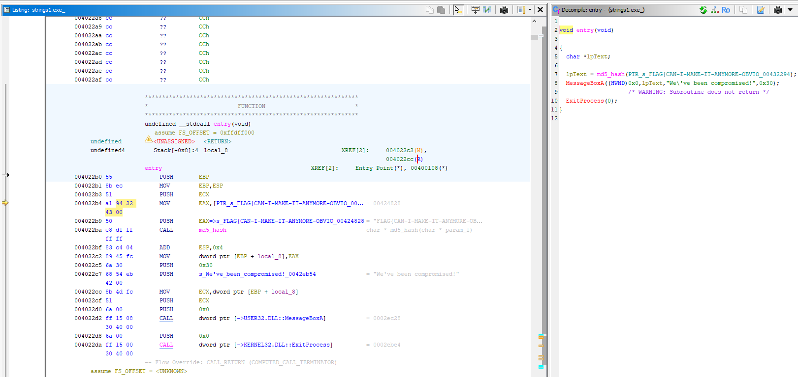
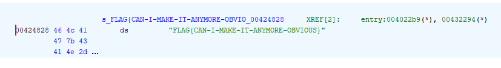
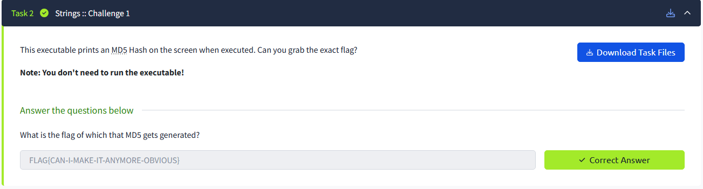
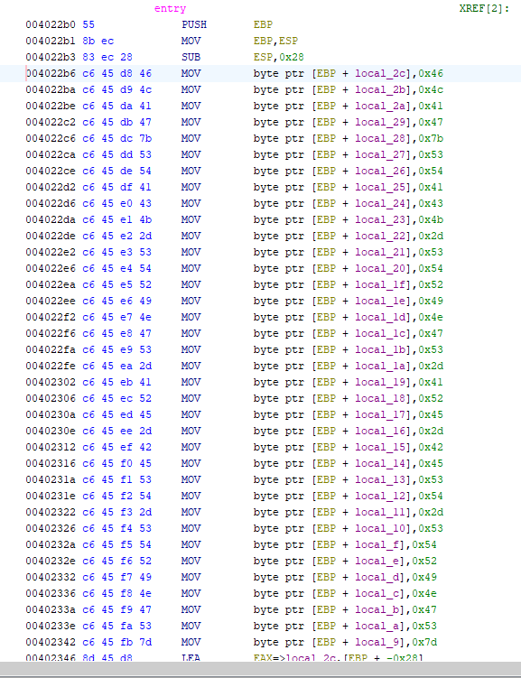
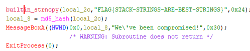
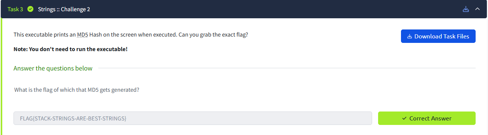
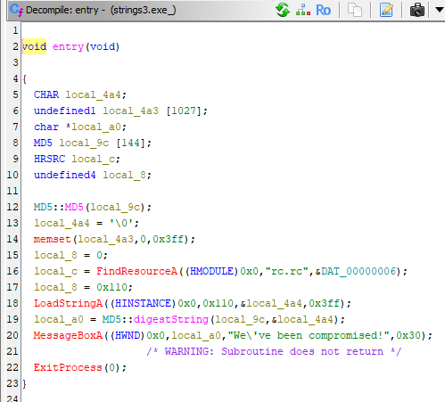
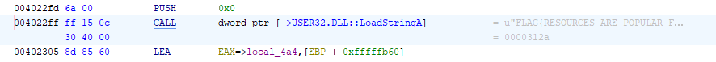
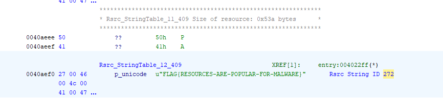
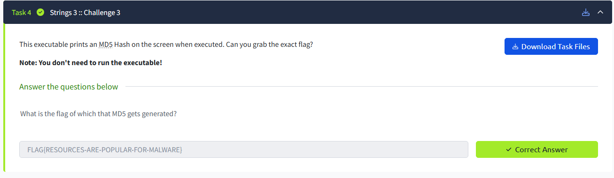

# CTF 1 - TryHackMe Basic Malware RE

### Flag 1

First, I downloaded the file from THM and opened it in Ghidra

In the `entry` function we can see part of the flag is being hashed to MD5. It seems the highlighted address may be holding the flag for this challenge.

At this address we can see the flag!

Confirming this is the right flag.

### Flag 2

Upon opening the file in Ghidra, we can see a bunch of strings being pushed to the stack

It looks like it is forming this string here.

Yep, that is the correct flag.

### Flag 3

When examining the entry function in ghidra, we can see where it gets called in the assembly.

We can also see that `LoadStringA` is passed a hardcoded value; `0x110`.

This is hex, when converted to an integer the value is `272`.

When we search for `272` we find what might be the flag, lets try it!

We got the flag!
