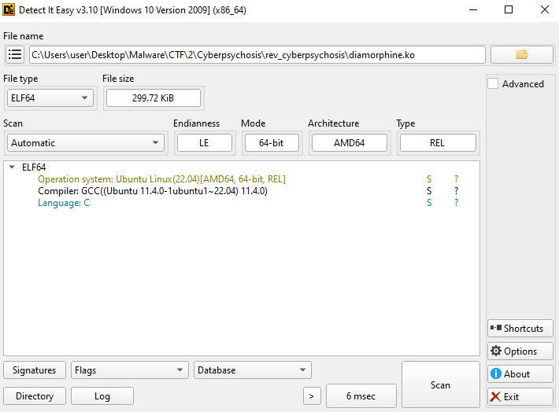
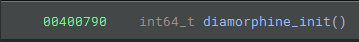
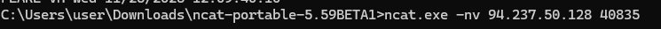
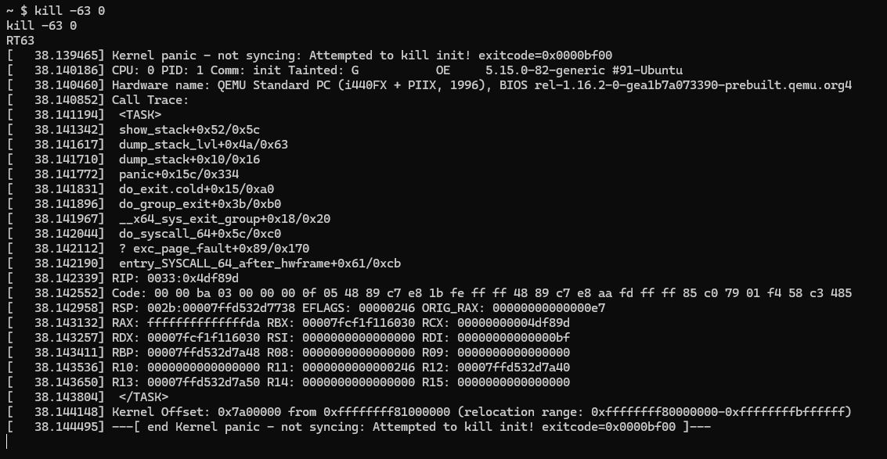
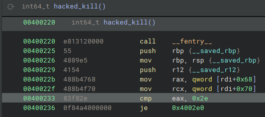
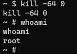
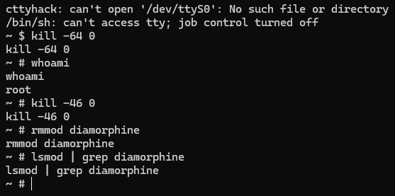

# CTF 2 – HackTheBox Cyberpsychosis

### Initial Analysis

After extracting the provided files (I couldn’t find the password anywhere but guessed `hackthebox` and that worked), I loaded the `.ko` file in Detect it Easy (DIE) and verified it is an ELF binary.  

Based on the method name, we infer it’s Diamorphine, a known Linux rootkit.  

There are uninstall instructions in the repository: <https://github.com/m0nad/Diamorphine>, which we will follow.  

### Further Analysis

Next, I opened a connection on the HTB machine using netcat.  
According to the GitHub uninstall guide, the module starts invisible — we need to run `kill -63 0` to make it visible.  

That command caused a kernel panic.  
Using Binary Ninja we observed that some `cmp` instructions point to altered values.  

This instruction — `cmp eax, 0x2e` — appears to be a new visibility toggle, corresponding to `kill -46`.  

This other modified instruction — `cmp eax, 0x40` — lets us trigger root access via `kill -64`.  

When we run `kill -64 0` on the HTB machine, we get root privileges.  

Now with root access, we’ll remove the rootkit.  

**Removal steps:**  

1. Trigger root access with `kill -64 0`.  
2. Make the rootkit visible with `kill -46 0`.  
3. Remove it: `rmmod diamorphine`.  
4. Confirm removal by checking kernel modules — nothing shows up for Diamorphine.  
