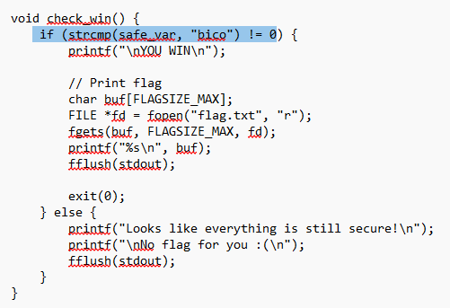
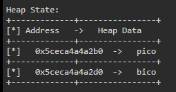
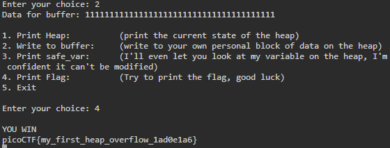
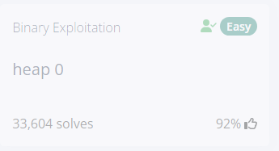

# PicoCTF Heap 0

### Code Review

 
Here is a snippet of the code (I opened it in notepad because my VM didn't have VSCode). We can see there is a `safe_var`, where if it has a value, we will get the flag. There is a vulnerable `scanf` call which we will be exploiting.

### Exploit

There are two addresses, `x63c3882552b0` and `0x63c3882552d0`.

We must find the difference between them to find how many bytes are needed to overflow this program.

`0x63c3882552d0` - `x63c3882552b0` = `0x20` (32)

By entering 33 characters we were able to overflow the buffer and write a value to `safe_var`, which gave us the flag!

Challenge solved!
