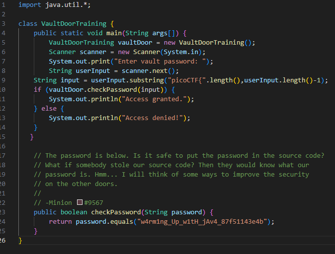

# PicoCTF Vault Door Training

### Analysis

In the below image we can see the flag is hardcoded into the code, it is `w4rm1ng_Up_w1tH_jAv4_87f51143e4b`.

I could not access the source code linked on picoCTF but found this sample of it online.
 

Having hardcoded credentials is a significant security risk because it means if someone gets access to your codebase they can see your secrets. It is also a very common path for attackers to escalate priveleges after an initial breach.
