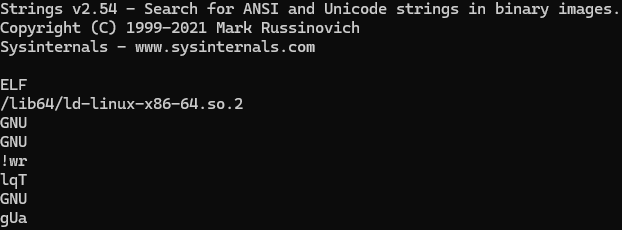
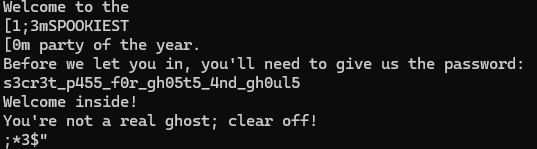
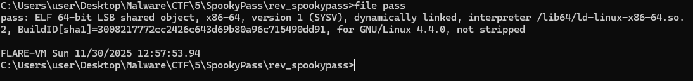
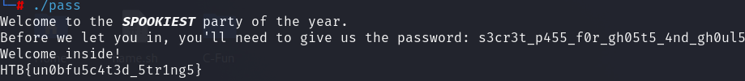
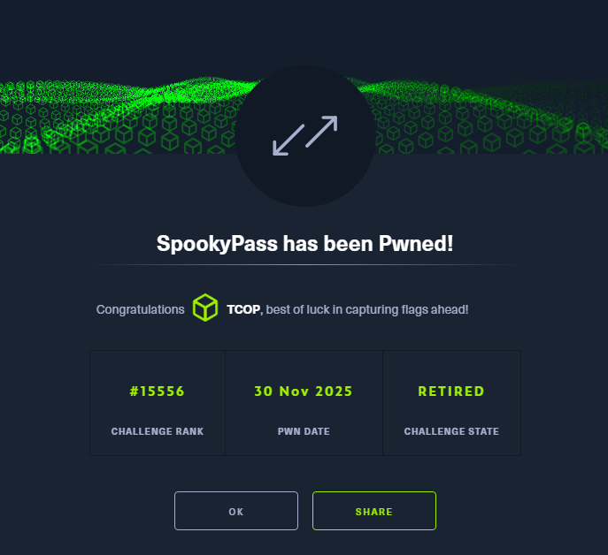

# Hack The Box - SpookyPass

### Analysis

This challenge is another reversing CTF. Before we begin examining the code with Ghidra, we will run `strings` and see what we find.

 

We may have found the password hardcoded into the codebase. If this is the case we won't even need to use Ghidra. Lets try it out!

Looks like this binary is made for Linux, I will need to swap to a new machine to run it.

Looks like the hardcoded password we found gave us the flag, lets try it out.

Nice! That flag worked.
