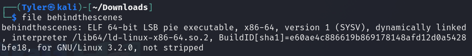
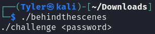

# HackTheBox - Behind the Scenes

### Analysis

Looking at this file, we can see it is a linux ELF file.

We need to find a password for it.

It looks like it's using the `strlen` and `strncmp` libraries.

### Ghidra

 
In the disassembled code we can see `strncmp` being called several times. This is where the program is checking the password. It cycles through this multiple times to check the characters in the given password.
 

This is the decompiled code where it is checking if the characters it is reading are part of the password. We can see in plaintext that it is checking for `Itz`.

It calls `strncmp` 3 more times, and we can see the characters it requires.

When we add all of the calls together, it gives us `HTB{Itz_0nLy_UD2}` for the flag.

Nice, that was the flag!
