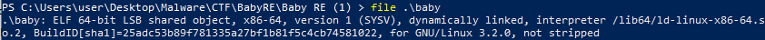
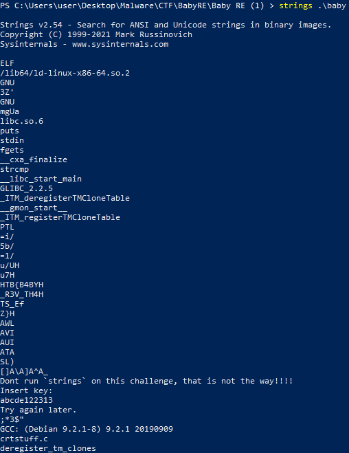
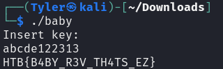

# HackTheBox - Baby RE

### Analysis

 
Looking at the executable, we can see it's a Linux ELF file.

I ran `strings` on the file to try and get more info, looks like they don't want me to use it for this challenge.

Running `ltrace` on the program shows that it's looking for `abcde122313` to be entered.

When we put that extracted password into the program it gives us the flag!

Nice, that worked!
